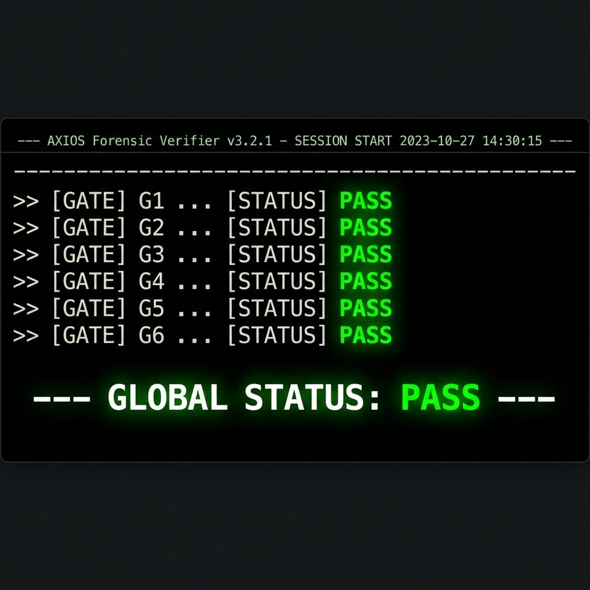
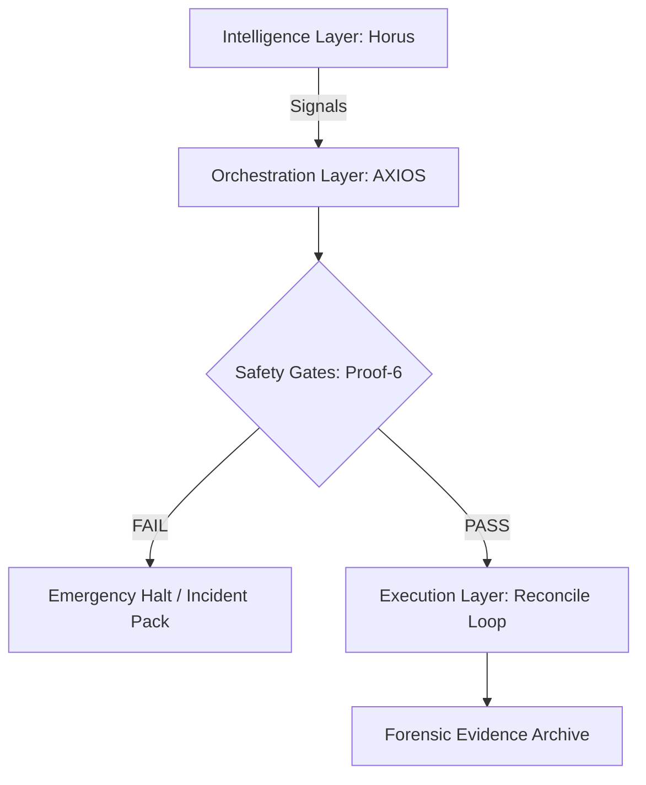

# AXIOS: Forensic-Grade Trading Orchestrator 🦅

[](https://github.com/Carefree1987/axios-forensic-orchestrator/actions/workflows/ci.yml)
[](LICENSE)

**AXIOS** is a high-integrity execution orchestrator designed for algorithmic trading. It treats every trade execution as a forensic event—documented, timestamped, and verifiable.

[English] | [Deutsch](#deutsch)

---

## 🎯 The 90-Second Recruiter Challenge
Verify the system's integrity right now. No setup required other than Python.

```bash
git clone https://github.com/Carefree1987/axios-forensic-orchestrator.git
cd axios-forensic-orchestrator
python scripts/verify_synthetic_pack.py examples/proof_pack_synthetic/v2_golden_pack
```



---

## 🏗️ Architecture: The "Exchange-as-Truth" Pattern
AXIOS operates on a zero-trust model. Local state is secondary; the exchange is the only source of truth.




---

## 🛡️ Proof-6 Gate Discipline
Every run must pass 6 hard gates before a single order is touched.

| Gate | Purpose | Verification |
| :--- | :--- | :--- |
| **G1: Integrity** | Verify code baseline vs SHA256 | Manifest signing |
| **G2: Connectivity** | Latency < 50ms to exchange | Sentinel ping |
| **G3: Risk Caps** | Exposure limits & drawdown checks | RiskV5 Controller |
| **G4: Sentinel** | External safety watchdog check | Heartbeat |
| **G5: Compliance** | Forensic JSONL logging active | Trace handlers |
| **G6: Handoff** | Evidence ZIP + Signature generation | Signed bundle |

---

## 🛠️ Competency Matrix

| Skill | Evidence in Repo |
| :--- | :--- |
| **Python (Advanced)** | Typed contracts, forensic verify scripts |
| **System Architecture** | Proof-6 Gating, Reconcile Loop design |
| **DevOps & CI/CD** | GitHub Actions, secret scanning, hardening |
| **Security** | Zero-leak policy, automated audits |

[View Results Matrix](docs/skills_matrix.en.md) | [Hiring Manager TL;DR](docs/hiring_manager_tldr.en.md)

---

## 📂 Documentation

- [Architecture Overview](docs/architecture.en.md)
- [Proof System Deep-Dive](docs/proof_system.en.md)
- [Operational Roadmap](docs/roadmap.en.md)
- [FAQ for Technical Recruiters](docs/faq_recruiters.en.md)

---

<br id="deutsch">

# AXIOS: Forensischer Trading-Orchestrator 🦅

**AXIOS** ist ein hochintegrierter Execution-Orchestrator für den algorithmischen Handel. Jeder Ausführungslauf wird als forensisches Ereignis behandelt – dokumentiert, zeitgestempelt und verifizierbar.

## 🎯 Recruiter-Check in 90 Sekunden
Verifizieren Sie die Systemintegrität sofort. Außer Python sind keine Voraussetzungen erforderlich.

```bash
git clone https://github.com/Carefree1987/axios-forensic-orchestrator.git
cd axios-forensic-orchestrator
python scripts/verify_synthetic_pack.py examples/proof_pack_synthetic/v2_golden_pack
```

---

## 🔑 Kernkonzepte
- **Exchange-as-Truth**: Der Broker-Status ist die einzige Wahrheit.
- **Proof-6 Disziplin**: 6 Sicherheits-Gates vor jeder Order.
- **Forensische Beweissicherung**: Jeder Lauf erzeugt einen signierten Audit-Trail.

[Hiring Manager TL;DR (Deutsch)](docs/hiring_manager_tldr.de.md) | [Skill-Matrix (Deutsch)](docs/skills_matrix.de.md)

---

**Dennis** | [GitHub](https://github.com/Carefree1987) | [Security Policy](SECURITY.md)
