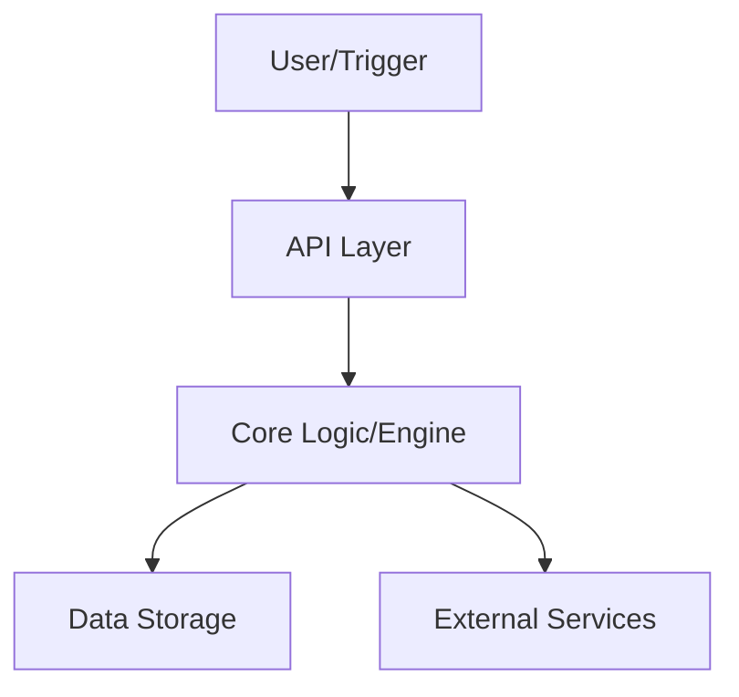

# AXIOS - Forensic Trading Orchestrator


> Professional-grade orchestration engine with full forensic auditing for algorithmic trading.

---

## 🚀 Overview
AXIOS - Forensic Trading Orchestrator is a production-ready solution focused on reliability, performance, and clear architecture. 
Designed for scalability and maintainability.

## ✨ Key Features
- Immutabe Audit Logs (EAGLE mode)- Real-time Execution Pipeline- Strict Risk Gating & Integrity Checks- Automated ProofPack Generation

## 🛠 Tech Stack
`Python 3.10+`, `FastAPI`, `SQLite/Postgres`, `Docker`, `Forensics`

## 🏗 Architecture


## 📦 Installation & Setup
```bash
# Clone the repository
git clone https://github.com/Carefree1987/axios-forensic-orchestrator
cd axios-forensic-orchestrator

# Setup environment
python -m venv venv
source venv/bin/activate  # or venv\Scripts\activate on Windows

# Install dependencies
pip install -r requirements.txt
```

## ⚖️ License
This project is licensed under the MIT License - see the [LICENSE](LICENSE) file for details.

## ✉️ Contact
Created by [KayD83](https://github.com/Carefree1987) - Feel free to reach out for collaboration!
