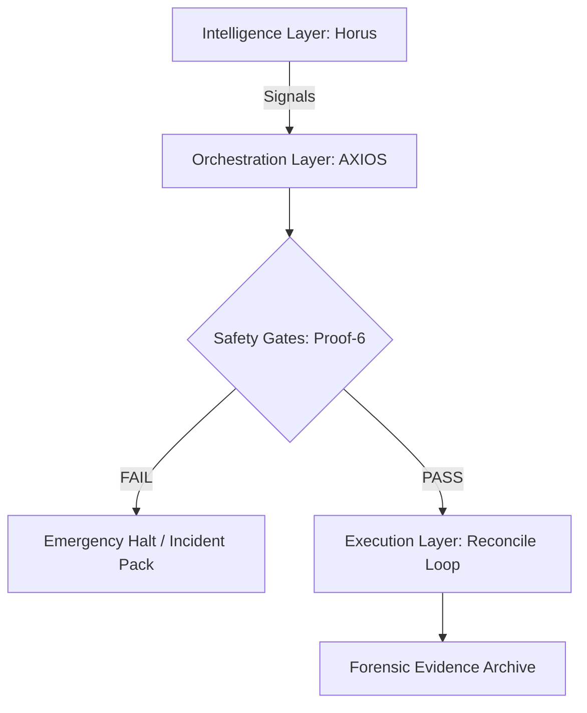

# AXIOS: Forensic-Grade Trading Orchestrator 🦅

[English] | [Deutsch](#deutsch)

**AXIOS** is a high-integrity execution framework designed for institutional-grade reliability in algorithmic trading. It prioritizes **forensic auditability**, **multilayered safety gates**, and a strict **"proof-first" discipline**.

> [!NOTE]
> This is a **Showcase Repository**. It contains the architectural blueprint, procedural documentation, and synthetic forensic artifacts. Proprietary execution logic and secrets are omitted by design.

---

## 🏗️ System Architecture

## 🛡️ The "Proof-6" Gate System
AXIOS enforced 6 mandatory verification gates before any micro-live execution:

| Gate | Purpose | Verification Method |
| :--- | :--- | :--- |
| **G1: Integrity** | Verify code state against known SHA256 baseline. | `git hash-object` / Manifest check |
| **G2: Connectivity** | Ensure secure, low-latency path to exchange. | Sentinel heartbeat / Ping audit |
| **G3: Risk Caps** | Strict enforcement of symbol & global exposure. | Deterministic RiskV5 Controller |
| **G4: Sentinel** | Multi-account safety check (Anti-Liquidation). | External heartbeat monitoring |
| **G5: Compliance** | Bilingual log-compliance and audit readiness. | Forensic JSONL trace |
| **G6: Final Handoff** | Bundle all evidence into a non-repudiable ZIP. | ZIP SHA256 + Manual Sign-off |

---

## 📈 Run Ladder (Phases)
AXIOS follows a strict progression ladder to manage risk from development to production:

- **L0: Sandbox** (Synthetic data, local logic test)
- **L1: Paper** (Real-time data, paper broker, zero risk)
- **L2: Micro-Live** (Strictly capped live orders, forensic audit required)
- **L3: Production** (Full-scale execution, restricted access)

---

## 🛠️ Recruiter Quick-Start
To evaluate the technical quality of this project in 3 minutes:
1. **Browse Architecture**: See [docs/architecture.en.md](docs/architecture.en.md).
2. **Verify a Run**: Run `python scripts/verify_synthetic_pack.py examples/proof_pack_synthetic/run_8a2b3c4d` to see the audit engine in action.
3. **Review Cleanliness**: Check the code structure and forensic logs in `/examples`.

---

 

# AXIOS: Forensischer Trading-Orchestrator 🦅

[English](#axios-forensic-grade-trading-orchestrator-) | [Deutsch]

**AXIOS** ist ein High-Integrity-Execution-Framework, entwickelt für institutionelle Zuverlässigkeit im algorithmischen Handel. Der Fokus liegt auf **forensischer Auditierbarkeit**, **mehrstufigen Safety-Gates** und einer strikten **"Proof-First" Disziplin**.

> [!NOTE]
> Dies ist ein **Showcase-Repository**. Es enthält den Architektur-Entwurf, Prozessdokumentationen und synthetische forensische Artefakte. Proprietäre Ausführungslogik und Geheimnisse sind systembedingt ausgelassen.

---

## 🏗️ Systemarchitektur

(Siehe Diagramm oben im englischen Bereich)

## 🛡️ Das "Proof-6" Gate-System
AXIOS erzwingt 6 obligatorische Verifizierungsschritte vor jeder Micro-Live-Ausführung:

| Gate | Zweck | Verifizierungsmethode |
| :--- | :--- | :--- |
| **G1: Integrität** | Code-Zustand gegen SHA256-Baseline prüfen. | Manifest-Abgleich |
| **G2: Konnektivität** | Sicherer Pfad zur Börse (Low-Latency). | Sentinel Heartbeat |
| **G4: sentinel** | Multi-Account Schutz (Anti-Liquidation). | Externes Monitoring |
| **G6: Handoff** | Bündelung aller Beweise in ein ZIP-Archiv. | ZIP SHA256 Checksumme |

---

## 🛠️ Schnelltest für Recruiter
Bewerten Sie die technische Qualität in 3 Minuten:
1. **Architektur**: Siehe [docs/architecture.de.md](docs/architecture.de.md).
2. **Run verifizieren**: Führen Sie `python scripts/verify_synthetic_pack.py` aus, um die Audit-Engine live zu erleben.

---

## 📜 Security Posture
- **No Secrets**: Alle API-Keys und IPs sind geschwärzt oder synthetisch.
- **Audit Pack**: Die beigefügten Beispiele dienen der Demonstration des forensischen Workflows.

**Dennis** | [LinkedIn](https://linkedin.com/in/<DENNIS_LINKEDIN>) | [GitHub](https://github.com/Carefree1987)
