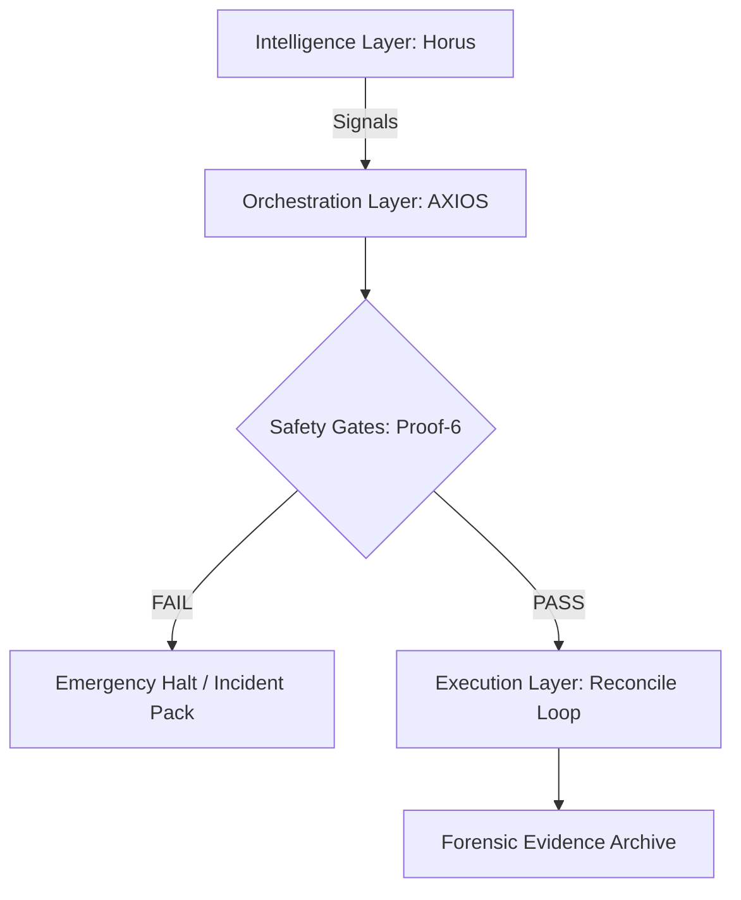

# AXIOS: Forensic-Grade Trading Orchestrator 🦅

[English] | [Deutsch](#deutsch)

> **For Hiring Managers**: See the [TL;DR](docs/hiring_manager_tldr.en.md) or verify the system in 90 seconds below.

---

## 🎯 Verify in 90 Seconds

```bash
git clone https://github.com/Carefree1987/axios-forensic-orchestrator.git
cd axios-forensic-orchestrator
python scripts/verify_synthetic_pack.py examples/proof_pack_synthetic/golden_a1b2c3d4
```
**Expected Output**: `GLOBAL STATUS: PASS`

---

## 🏗️ System Architecture



---

## 🛡️ The "Proof-6" Gate System

| Gate | Purpose | Verification |
| :--- | :--- | :--- |
| **G1: Integrity** | Code state vs SHA256 baseline | Manifest check |
| **G2: Connectivity** | Exchange latency < 50ms | Sentinel ping |
| **G3: Risk Caps** | Exposure limits enforced | RiskV5 Controller |
| **G4: Sentinel** | External safety watchdog | Heartbeat |
| **G5: Compliance** | Forensic logging active | JSONL trace |
| **G6: Handoff** | Evidence ZIP + SHA256 | Signed bundle |

---

## 📈 Run Ladder (Operational Phases)

| Phase | Name | Description | Risk |
| :---: | :--- | :--- | :---: |
| **L0** | Sandbox | Synthetic data, logic tests | None |
| **L1** | Paper | Real-time data, zero capital | None |
| **L2** | Micro-Live | Capped live orders, audit required | Low |
| **L3** | Production | Full execution, restricted | High |

---

## 🛠️ Skills Matrix (Snapshot)

| Skill | Level | Evidence |
| :--- | :---: | :--- |
| Python | ⭐⭐⭐⭐⭐ | `/scripts/`, typed contracts |
| System Architecture | ⭐⭐⭐⭐⭐ | `/docs/architecture.en.md` |
| Security | ⭐⭐⭐⭐⭐ | Zero secrets, detect-secrets |
| Linux/DevOps | ⭐⭐⭐⭐⭐ | Server hardening, VLANs |
| Technical Writing | ⭐⭐⭐⭐⭐ | Bilingual docs (EN/DE) |

[Full Skills Matrix →](docs/skills_matrix.en.md)

---

## 📂 Documentation Index

| Document | EN | DE |
| :--- | :---: | :---: |
| Hiring Manager TL;DR | [EN](docs/hiring_manager_tldr.en.md) | [DE](docs/hiring_manager_tldr.de.md) |
| Architecture | [EN](docs/architecture.en.md) | [DE](docs/architecture.de.md) |
| Proof System | [EN](docs/proof_system.en.md) | [DE](docs/proof_system.de.md) |
| Skills Matrix | [EN](docs/skills_matrix.en.md) | [DE](docs/skills_matrix.de.md) |
| Roadmap | [EN](docs/roadmap.en.md) | [DE](docs/roadmap.de.md) |
| Security | [EN](docs/security.en.md) | [DE](docs/security.de.md) |
| FAQ | [EN](docs/faq_recruiters.en.md) | [DE](docs/faq_recruiters.de.md) |
| Quickstart | [Guide](docs/quickstart.md) | |

---

## 🔐 Security Posture

- **No Secrets**: This repository contains **ZERO** API keys, IPs, or credentials.
- **Synthetic Only**: All proof packs are artificially generated for demonstration.
- **Automated Scans**: `detect-secrets` integrated via pre-commit hooks.

---

<br id="deutsch">

# AXIOS: Forensischer Trading-Orchestrator 🦅

[English](#axios-forensic-grade-trading-orchestrator-) | [Deutsch]

> **Für Hiring Manager**: Siehe das [TL;DR](docs/hiring_manager_tldr.de.md) oder verifiziere das System in 90 Sekunden oben.

## 🎯 In 90 Sekunden verifizieren

```bash
git clone https://github.com/Carefree1987/axios-forensic-orchestrator.git
cd axios-forensic-orchestrator
python scripts/verify_synthetic_pack.py examples/proof_pack_synthetic/golden_a1b2c3d4
```
**Erwarteter Output**: `GLOBAL STATUS: PASS`

---

## 🔐 Sicherheitskonzept

- **Keine Secrets**: Dieses Repo enthält **KEINE** API-Keys, IPs oder Credentials.
- **Nur Synthetisch**: Alle Proof Packs sind künstlich generiert.
- **Automatisierte Scans**: `detect-secrets` via pre-commit Hooks.

---

**Dennis** | [GitHub](https://github.com/Carefree1987)
